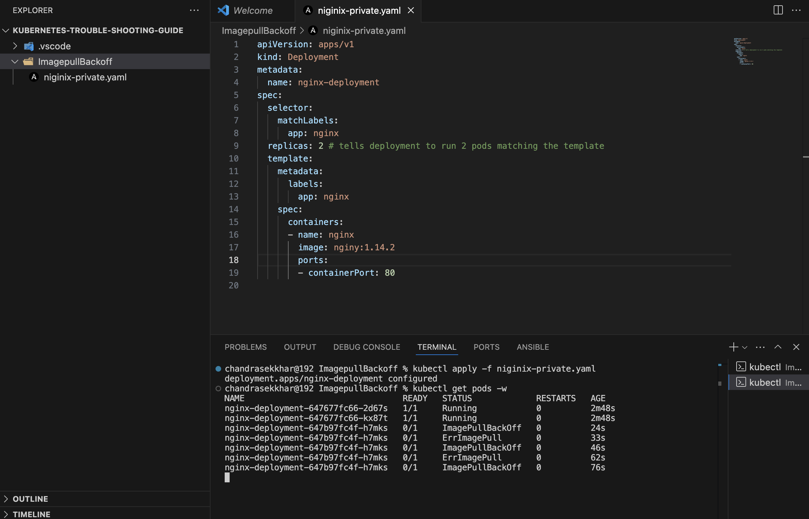
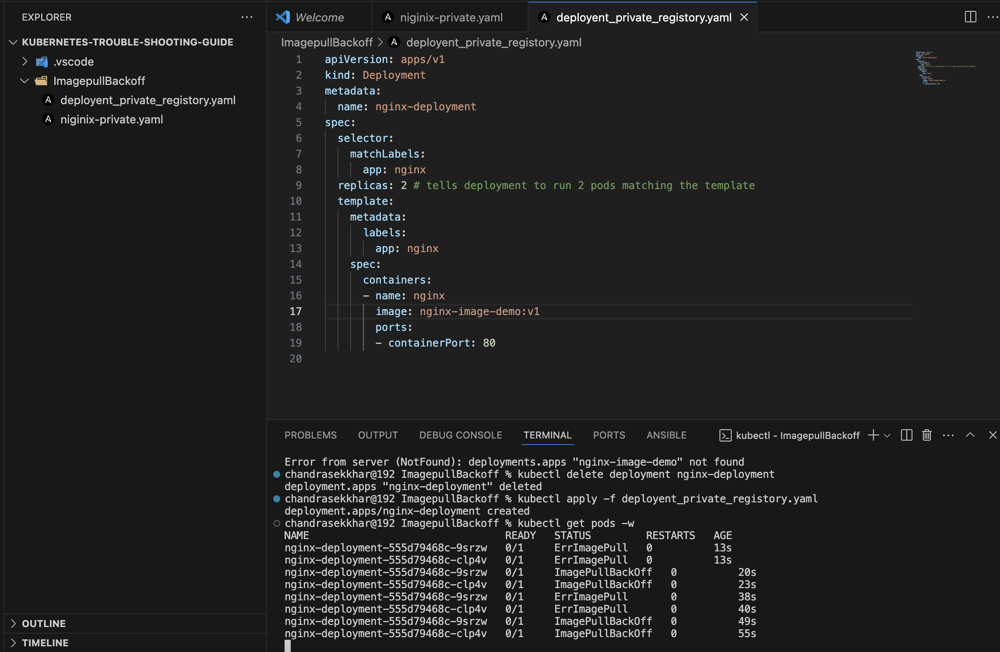

# 🔧 Kubernetes Troubleshooting Guide: ImagePullBackOff

This section documents common causes of the `ImagePullBackOff` error in Kubernetes and how to resolve them. We'll demonstrate with two real examples.

---

## 🐳 Docker Image Preparation

Before we deploy, let’s prepare our custom image and push it to Docker Hub.

### 🔨 1. Build Docker Image

```bash
docker build -t nginx-image-demo:v1 .
```

### 🏷️ 2. Tag the Image for Docker Hub

```bash
docker tag nginx-image-demo:v1 chandra005/nginx-image-demo:v1
```

### 📤 3. Push Image to Docker Hub

```bash
docker push chandra005/nginx-image-demo:v1
```

> ✅ You should see the image uploaded to your Docker Hub repo:
> [https://hub.docker.com/repository/docker/chandra005/nginx-image-demo](https://hub.docker.com/repository/docker/chandra005/nginx-image-demo)

### 🔒 4. Make Image Private

To make your image private:

1. Go to your Docker Hub repository page.
2. Click on **"Settings"**.
3. Scroll down to **"Visibility"**.
4. Select **"Private"**.

---

## ❌ Scenario 1: Invalid Image Name

### Description

Kubernetes cannot pull the container image because the image name provided in the YAML file is incorrect or doesn't exist in the Docker registry.

### Screenshot



### YAML File

```yaml
apiVersion: apps/v1
kind: Deployment
metadata:
  name: nginx-deployment
spec:
  selector:
    matchLabels:
      app: nginx
  replicas: 2
  template:
    metadata:
      labels:
        app: nginx
    spec:
      containers:
        - name: nginx
          image: nginy:1.14.2  # ❌ Invalid image name
          ports:
            - containerPort: 80
```

### Fix

Correct the image name:

```yaml
image: nginx:1.14.2
```

---

## 🔒 Scenario 2: Private Image Registry (Authentication Required)

### Description

Even when the image name is correct, if it resides in a **private Docker registry**, Kubernetes cannot pull it without credentials. This results in an `ImagePullBackOff` error.

### Screenshot



### YAML File

```yaml
apiVersion: apps/v1
kind: Deployment
metadata:
  name: nginx-deployment
spec:
  selector:
    matchLabels:
      app: nginx
  replicas: 2
  template:
    metadata:
      labels:
        app: nginx
    spec:
      containers:
        - name: nginx
          image: chandra005/nginx-image-demo:v1  # ✅ Correct image, but private
          ports:
            - containerPort: 80
      imagePullSecrets:
        - name: demo
```

### Solution: Create Secret for Private Registry

```bash
kubectl create secret docker-registry demo \
  --docker-server=https://index.docker.io/v1/ \
  --docker-username=chandra005 \
  --docker-password=Amma@0911 \
  --docker-email=chandrasekharchadalawada7@gmail.com
```

---

## ✅ Result

After fixing the above issues, the pod should transition to a `Running` state:

```bash
kubectl get pods
```

---


