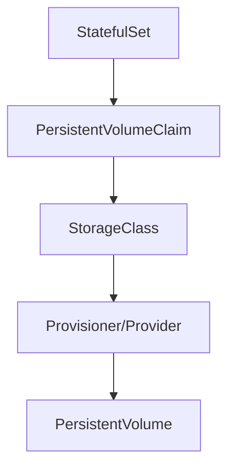

````markdown
# 🧩 Day-4 | StatefulSet with Persistent Volume not working after Cloud Migration | How to fix it?

This document walks you through a real-world scenario where a Kubernetes `StatefulSet` failed to mount volumes after migrating clusters across clouds or regions. This issue is common during lift-and-shift operations involving persistent storage.

---

## 📦 Sample YAML: StatefulSet with VolumeClaimTemplate

```yaml
apiVersion: apps/v1
kind: StatefulSet
metadata:
  name: web
spec:
  selector:
    matchLabels:
      app: nginx
  serviceName: "nginx"
  replicas: 3
  minReadySeconds: 10
  template:
    metadata:
      labels:
        app: nginx
    spec:
      terminationGracePeriodSeconds: 10
      containers:
      - name: nginx
        image: registry.k8s.io/nginx-slim:0.8
        ports:
        - containerPort: 80
          name: web
        volumeMounts:
        - name: www
          mountPath: /usr/share/nginx/html
  volumeClaimTemplates:
  - metadata:
      name: www
    spec:
      accessModes: [ "ReadWriteOnce" ]
      storageClassName: Ebs
      resources:
        requests:
          storage: 1Gi
````

---

## 🧭 Flowchart: Volume Binding in StatefulSets



---

## ☁️ Real-World Case: AWS EKS Example

**Problem**:
StatefulSet pods were stuck in `Pending` state after migrating an EKS cluster from one region to another.

**Key Cause**:
The PVC was bound to a `StorageClass` that used an EBS volume provisioner tied to the **old region**. EBS volumes are region-specific and cannot be accessed across AWS regions.

---

## 🧪 Troubleshooting Steps

1. ✅ Check pod status:

   ```bash
   kubectl get pods
   ```

2. ✅ Check events:

   ```bash
   kubectl describe pod <pod-name>
   ```

   **Expected error**:

   ```
   Failed to provision volume with StorageClass "Ebs": invalid zone ...
   ```

3. ✅ Check PVC:

   ```bash
   kubectl get pvc
   ```

4. ✅ Check StorageClass:

   ```bash
   kubectl get sc
   kubectl describe sc Ebs
   ```

---

## 🛠️ Fixes

* Use a region-appropriate EBS CSI driver and correct StorageClass:

  ```yaml
  storageClassName: gp2 # or gp3 depending on region support
  ```

* Ensure the default StorageClass is available:

  ```bash
  kubectl patch storageclass gp2 -p '{"metadata": {"annotations":{"storageclass.kubernetes.io/is-default-class":"true"}}}'
  ```

* Recreate StatefulSet with updated configuration:

  ```bash
  kubectl delete sts <name> --cascade=orphan
  kubectl delete pvc -l app=nginx
  kubectl apply -f updated-statefulset.yaml
  ```

---

## 🧾 Summary Table

| Component      | Role                                                   |
| -------------- | ------------------------------------------------------ |
| `StatefulSet`  | Defines pod template with volumeClaimTemplates         |
| `PVC`          | Automatically created from volumeClaimTemplates        |
| `StorageClass` | Determines the dynamic provisioning behavior           |
| `Provisioner`  | Calls the correct CSI driver (e.g., `ebs.csi.aws.com`) |
| `PV`           | Actual AWS EBS volume allocated dynamically            |

---

## 🧠 Key Learnings

* **StatefulSets + PVCs** require correct `StorageClass` binding.
* **EBS volumes** are **region-locked**, so migrations across regions need storage reconfiguration.
* Always verify CSI driver and StorageClass setup after migration.
